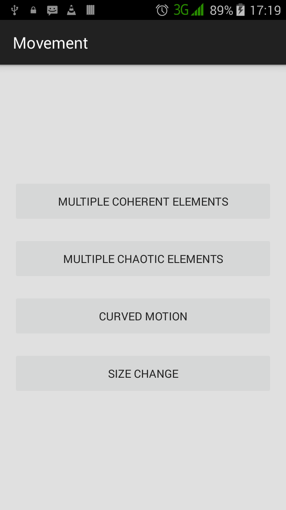
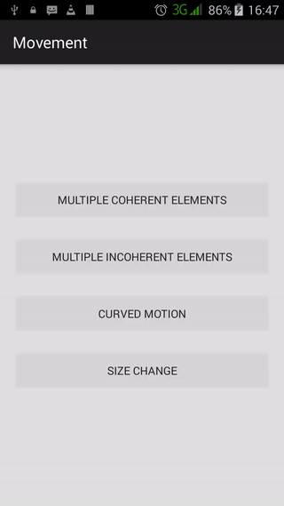
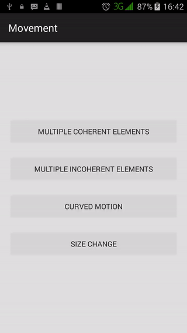
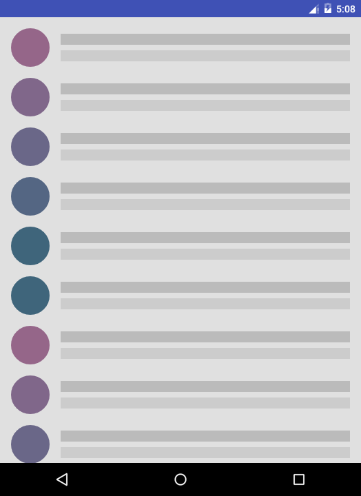
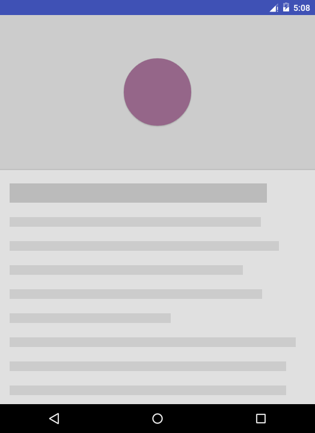
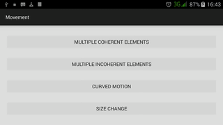

# movement

More mobile movement. :smile:

## Introduction :point_up:

This repository has code for an Android app that shows how to handle component motion in Android using the [compatibility library](https://developer.android.com/topic/libraries/support-library/features.html#v7-appcompat) only. This app is made from material covered in an online class called [Material Design for Android Developers](https://www.udacity.com/course/material-design-for-android-developers--ud862) offered by [Udacity](https://www.udacity.com/). Android [Material Design](https://developer.android.com/design/material/index.html) specifies the need for rational motion - and this app was used to illustrate how to move and scale items correctly. Original code is [here](https://github.com/udacity/ud862-samples) on GitHub in the [CoordinatedMotion](https://github.com/udacity/ud862-samples/tree/master/CoordinatedMotion) folder.

## Version History :package:

**latest** 	[Movement v1.0.0](https://github.com/joshua-kairu/movement/releases/download/v1.0.0/Movement-v1.0.0.apk) 	Monday, July 4, 2016

This repo tries its best to follow the [Semantic Versioning](http://semver.org/) guidelines.

## How To Use :wrench:

:zero: Install and run the app.

:one: You will find four buttons looking like:

 

:two: Tapping on the `Multiple Coherent Elements` button shows how multiple elements can be animated coherently, as seen below:

 

:three: Tapping on the `Multiple Chaotic Elements` button will show how multiple elements can be animated very incoherently. This is, generally, bad behaviour, as you can see below:

 

:four: When `Curved Motion` is tapped, if you are running a Lollipop device, you'll get a screen that is somewhat a mockup of a chat list. Looks like this: 

 

Choosing an item in the list will take you to a mock details screen, appearing like:

The color of the circle at the top may vary a little depending on which list item is selected, it should be said.

Depending on the position of the selected item in the list, the circle may transition from the left of the list to the top center of the detail and back following either a straight or curved path.

Earlier, we put the condition that this works if one is running a Lollipop device. What if someone is allergic to candy? The result is something like this:

 

Not very sweet :candy:, eh? :wink:

:five: Choosing to chose `Size Change` will take you to a screen with a small rectangle and two buttons labelled `The Bad` and `The Good`. Tapping either will show the bad and the good way to resize components in Android. Here:

 

## How It Works

Let's organize this based on the buttons:

* Coherent item animation is done by offsetting the item's position relative to top (aka the item's [translationY](https://developer.android.com/reference/android/view/View.html#attr_android:translationY) by a certain value and then animating it to its final position (when translationY is zero). Increasing this offset by a small magnitude between individual items makes for an added niceness.

* Chaotic item animation involves bringing items into the screen from wherever. It is done by randomizing the item's translationY and [translationX](https://developer.android.com/reference/android/view/View.html#attr_android:translationX) (translationX is an item's position relative to the start edge of the parent view) and then animating these values to zero.

* Curve motion is accomplished by putting a custom transition in the [res/transition/](app/src/main/res/transition) and inside that transition having an `xml arcMotion` tag. (Information on arc motion in Android can be found [here](https://developer.android.com/reference/android/transition/ArcMotion.html).) In XML we also specify which view we want to implement a [shared content transition](https://developer.android.com/training/material/animations.html#Transitions) on by giving it a [transition name](https://developer.android.com/reference/android/R.attr.html#transitionName). After this is done, we use code to tell the system to transition using that custom transition.

* Size change is a simple scale animation of item width and height. Good size changing should affect length and width at different times otherwise it would look like a zoom.

## Abilities :muscle:

This app simply shows how to implement good practices in Android item animation by showing how to achieve:
* Coherence in motion
* Incoherence in motion :specs:
* Curved shared element motion across activities
* Size change without confusing the user

## Limitations :worried:

This app is simply a demonstration. So:
* The views have not text
* No haptic feedback available :bowtie:

Also, I haven't found a way to use curved motion pre-Lollipop.

## Possible Future Work :fast_forward:

As of Monday, July 4, 2016, future things to do here might be: 
- [ ] Allow users to choose the speed of animation of the coherent items
- [ ] Implement curved motion for compatibility
- [ ] Respond to orientation change

## Other things :books:

Thumbs up :+1: to:
* The Udacity people for the class. Liking it. :smile:
* Jake Wharton for [Butter Knife](http://jakewharton.github.io/butterknife/), a library for binding fields to views in Android. This was used to bind the card used to show size change so that it could act on button taps.
* You for reading up to here. :smile:

I have yet to get a Lollipop device. But I wait. And the emulator helps me get screenshots at least. :smile:

## License :lock_with_ink_pen:

This repository is licensed under the [GNU General Public License Version 3](http://www.gnu.org/licenses/gpl-3.0.en.html).
